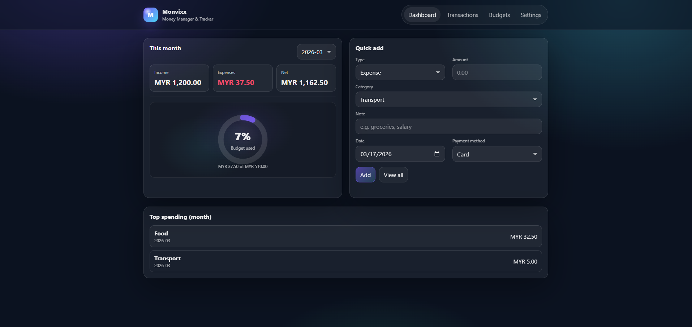
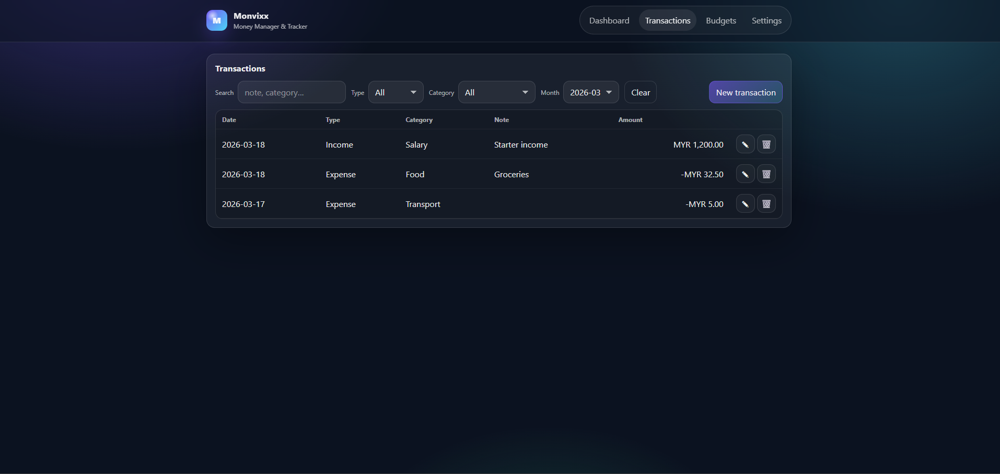
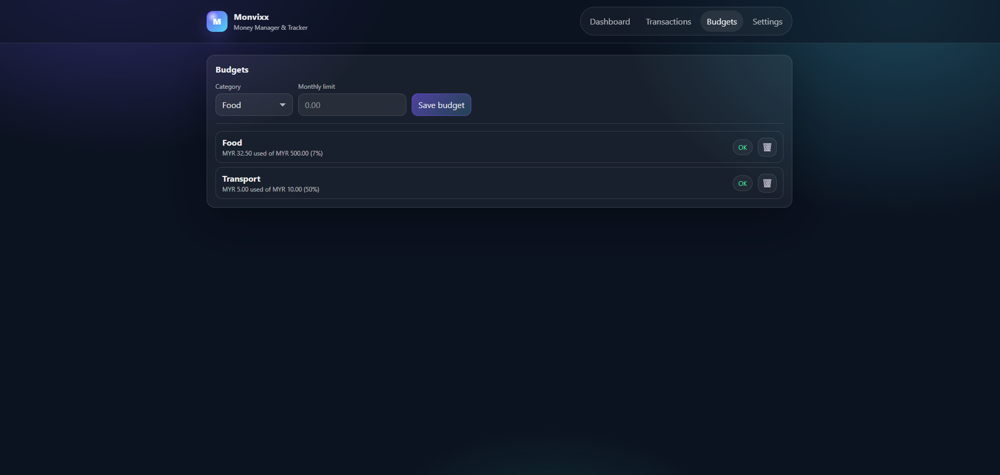
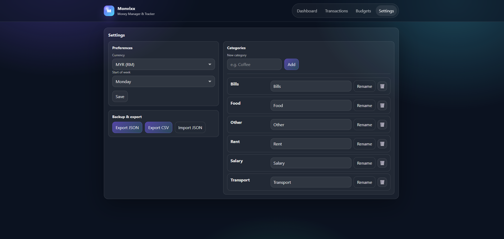

# Monvixx
A personal money manager & expense tracker built for learning and showcase purposes.

---

## Overview
Monvixx is a personal finance tracking application designed to help manage income, expenses, and financial insights in a simple and visual way.

This project was developed as part of my learning journey and portfolio to demonstrate skills in web-based development, data visualization, and UI design.

---

## Features
- Track income and expenses
- Categorize transactions
- Visualize financial data
- Filter data by category, date, or type
- Clean and user-friendly dashboard interface

---

## Screenshots
- Dashboard Page
  

- Transactions Page

- Budgets Page

- Settings Page

---

